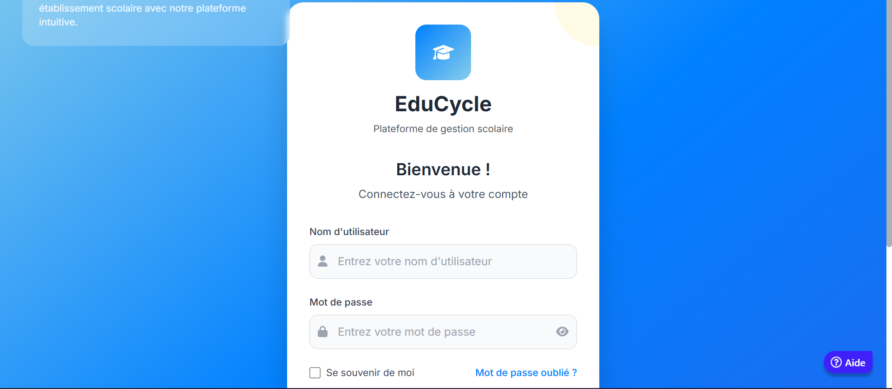

  

  

# Gestion Scolaire Primaire - Laravel

**Gestion Scolaire Primaire** est une plateforme web développée en **Laravel**, destinée à la gestion complète des écoles primaires. Elle permet aux administrateurs, directeurs, enseignants, comptables, élèves et parents de gérer efficacement toutes les opérations scolaires, incluant les inscriptions, la gestion des classes, enseignants et élèves, la saisie des notes, les bulletins, les paiements, les emplois du temps et les statistiques.  

L’application offre une interface intuitive, responsive et sécurisée, permettant un suivi précis des informations scolaires et financières.

---

## 🔐 Authentification
- **Page Login / Connexion**  
  - Champs : Nom d’utilisateur et Mot de passe  
  - Bouton : "Se connecter"  
 

---

## 🏫 Super-Admin
### Tableau de bord Super-Admin
- Cartes statistiques : nombre d’établissements, nombre total d’élèves, répartition par établissement  
- Liste des alertes importantes et notifications  
- Interaction : cliquer sur un établissement pour accéder à sa gestion  

### Gestion des établissements
- Table/listing des établissements avec filtres et recherche  
- Boutons : Ajouter, Modifier, Supprimer  
- Formulaire modal pour créer ou modifier un établissement  
  - Champs : nom, adresse, email, mot de passe, logo (avec prévisualisation)  
- Validation en front-end et feedback visuel  

### Gestion des rôles & permissions
- Listing des rôles existants  
- Boutons : Ajouter ou Modifier un rôle  
- Checklist des permissions par page et fonctionnalité  
- Activation/désactivation des permissions avec confirmation  

---

## 🎓 Directeur / Administrateur
### Tableau de bord école
- Vue synthétique : nombre d’élèves, enseignants, finances globales  
- Alertes importantes : paiements en retard, absences, événements  
- Graphiques interactifs et KPI avec possibilité de clic pour détails  

### Gestion des classes
- Listing des classes avec recherche et filtres  
- Boutons : Ajouter / Modifier / Supprimer  
- Formulaire modal pour création ou modification de classe  

### Gestion des enseignants
- Table des enseignants  
- Actions : affectation aux classes et matières  
- Recherche et pagination  

### Gestion des élèves
- Table des élèves avec tri, filtre par classe et recherche  
- Actions : Ajouter, Modifier, Transférer ou Supprimer  
- Feedback visuel et validation des formulaires  

### Décisions de promotion
- Liste des élèves avec moyenne et statut  
- Actions groupées : validation ou export PDF  

### Génération des bulletins
- Aperçu en temps réel des bulletins  
- Boutons : Télécharger PDF et Imprimer  
- Mise à jour automatique lors de modification des notes  

### Statistiques par niveau
- Graphiques interactifs par classe, matière et période  
- Export PDF / CSV  

---

## 💰 Comptable / Caissier
### Liste des frais
- Tableau avec filtres par classe et période  
- Boutons : Ajouter / Modifier / Supprimer  

### Inscriptions
- Formulaire modal pour ajout/modification  
- Champs : élève, matricule, tuteur, classe  
- Validation et feedback visuel  

### Paiements reçus
- Table avec filtres par élève, date et mode de paiement  
- Boutons : Générer reçu PDF, relancer paiement  
- Graphiques pour suivi global  

### Rapports financiers
- Tableau synthétique + graphiques interactifs  
- Export PDF / CSV  

---

## 👨‍🏫 Enseignant
### Liste des élèves
- Tableau listant les élèves par classe  
- Boutons : saisie des notes et prise de présence  

### Saisie des notes
- Tableau éditable par élève / matière / période  
- Calcul automatique des moyennes  
- Bouton : Enregistrer  

### Prise de présence
- Liste des élèves avec cases à cocher  
- Bouton : Enregistrer  
- Notifications automatiques aux parents  

### Notifications aux parents
- Formulaire d’envoi de messages  
- Liste des messages envoyés  
- Filtrage par type (devoir, absence, réunion)  

---

## 👨‍👩‍👧 Élève / Parent
### Portail personnel
- Informations personnelles, classe, contacts  
- Onglets : Bulletins, Paiements, Emploi du temps, Absences  

### Bulletins
- Aperçu et téléchargement PDF  
- Historique par période  

### Historique des absences
- Tableau filtrable par matière et période  

### Notifications
- Statut lu/non lu  
- Filtrage par type de notification  

---

## 📅 Emploi du temps / Examens
- Tableau par classe ou enseignant  
- Boutons : Ajouter / Modifier / Supprimer cours ou examen  
- Export PDF / CSV  

---

## 📊 Statistiques et Analyses
- Graphiques interactifs : moyennes, taux de réussite, top/bottom performers  
- Filtres : classe, niveau, matière, période  
- Export PDF / CSV  

---

## 📄 Bulletins
- Aperçu avant impression  
- Boutons : Télécharger PDF et Imprimer  
- Sections : notes, appréciations, absences, remarques personnalisées  
- Historique complet des bulletins  

---

> _Gestion Scolaire Primaire – Simplifier la gestion des écoles et garantir un suivi complet des élèves et enseignants._
